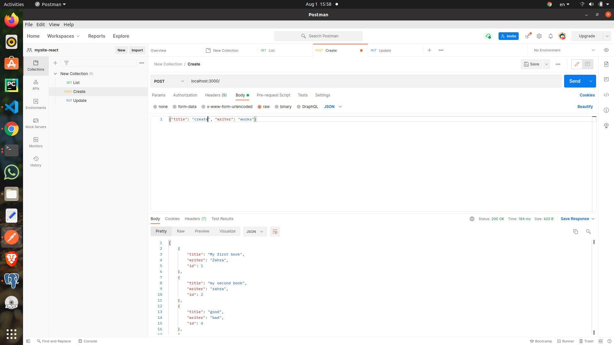
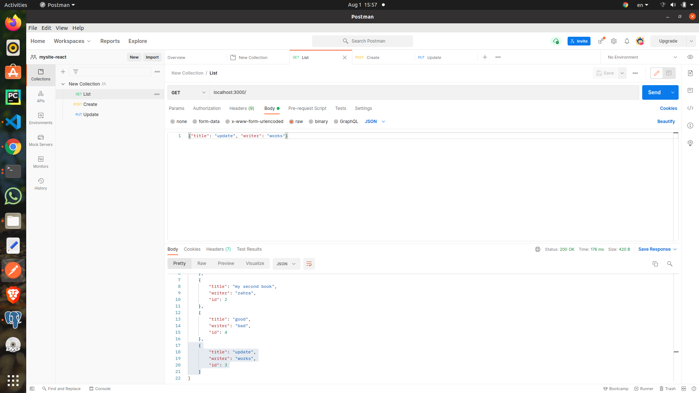
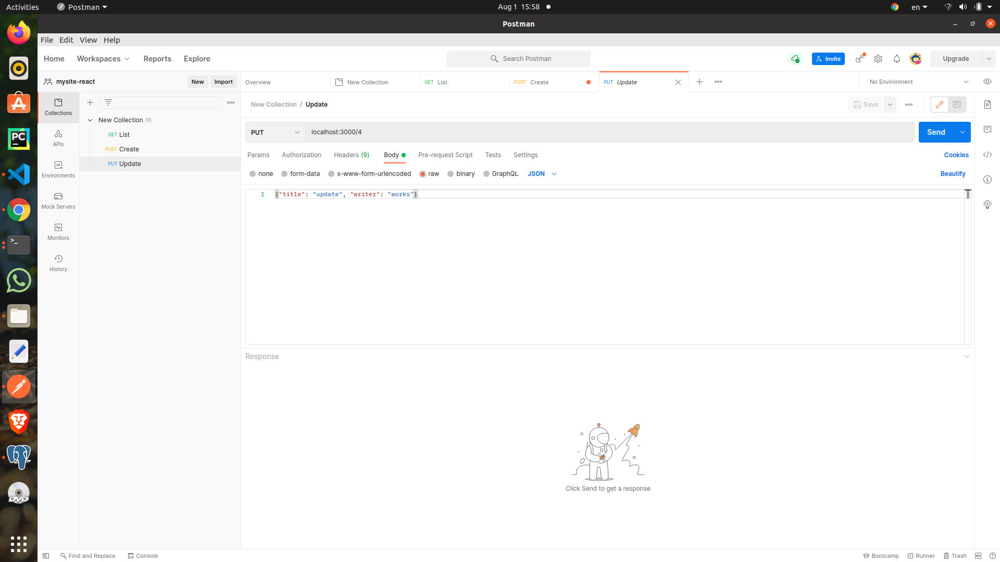
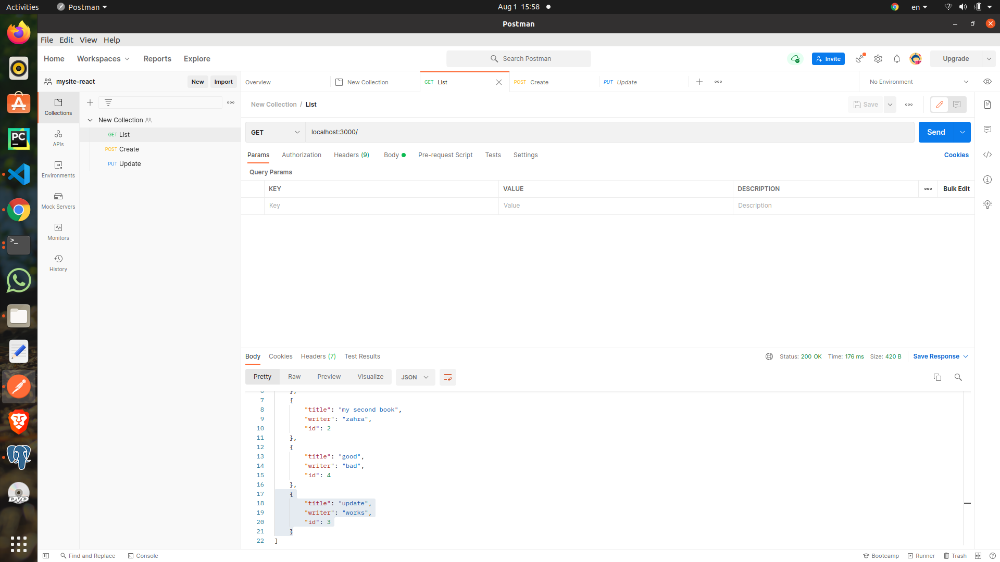
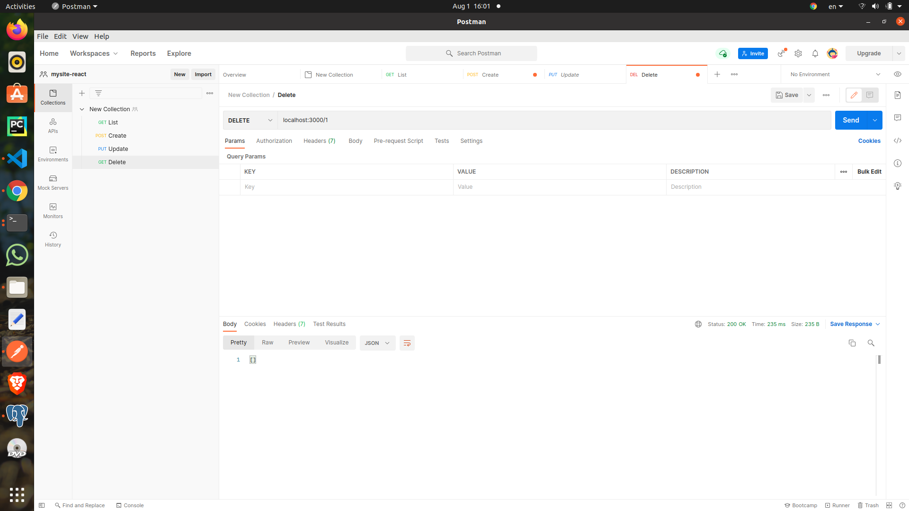
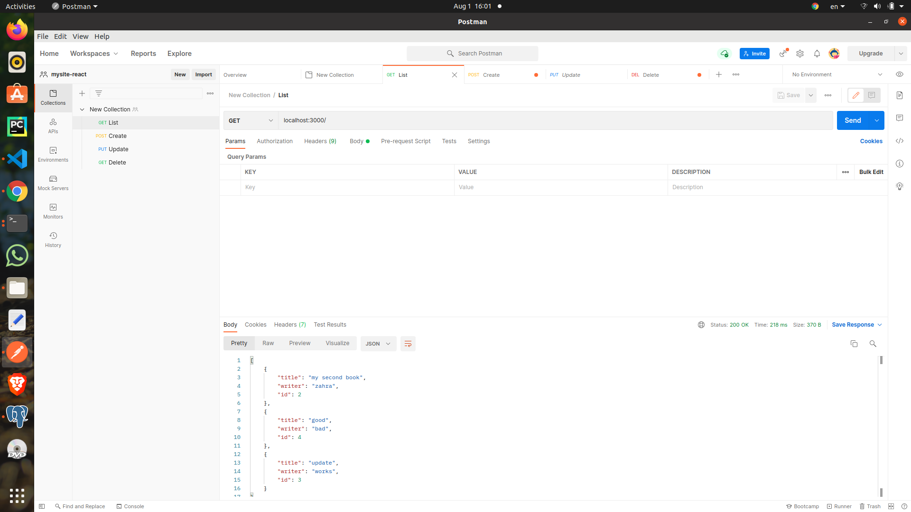

# starting project

```bash
mkdir api
cd api
npm init
```

# Installing express

```bash
npm i express
npm i nodemon # for watching file updates
npm i body-parser
```

# Installing pg

```bash
npm i pg-promise
```

# Running your express app
```bash
node index.js
```
or with nodemon
```bash
npx nodemon index.js
nodemon index.js # if you have installed it globally
```

# Express
## Running server
```js
const express = require('express')
const app = express()
const port = 3000 // this is just a variable, you can use process.env to set it using environment


app.get('/', (req, res) => {
  res.send("HELLO WORLD")
})

app.delete('/:id', (req, res) => {
  
})

app.listen(port, () => {
  console.log(`Example app listening on port ${port}`)
})

```

## Installing body parser
In order to acccess request body in express we use bodyParser:
```js
const bodyParser = require('body-parser')

app.use(bodyParser.json())
app.use(bodyParser.urlencoded({ extended: true}))

app.post('/', async (req, res) => {
  console.log(req.body)
  return res.json(req.body)
})

```

## Connecting to database
### Creating the database in pgAdmin:
In pg admin, connect to your postgres server and create a new database.

### Creating migration files:
Create a migration folder, inside of it write all your database migrations. For example for creating a new table:

```sql
CREATE TABLE books (
  title varchar(50),
  writer varchar(50),
  id  INT GENERATED ALWAYS as IDENTITY
);

```

Then you can use pgAdmin's query tool to apply these migrations to the database

### Connecting to the database:
```js
const pgp = require('pg-promise')(/* options */)
const db = pgp('postgres://[database_user]:[database_password]@[database_url]:[database_port]/[database_name]')

```

then you can query the database:
```js
db.query('SELECT * FROM books')
```

## Writing a CRUD API
```js

app.get('/', async (req, res) => {
  const data = await db.query(`
    SELECT * FROM books ;
  `)
  console.log(data)
  return res.json(data)
})
app.post('/', async (req, res) => {
  // return res.json(req.body)
  const data = await db.query(`
  INSERT INTO books(title, writer) VALUES ($1, $2) RETURNING id
  `, [req.body.title, req.body.writer])
  console.log(data)
  return res.json(data)
})

app.put('/:id', async (req, res) => {
  // return res.json(req.body)
  const data = await db.query(`
  UPDATE books SET title=$1, writer=$2 WHERE id=$3
  `, [req.body.title, req.body.writer, req.params.id])
  console.log(data)
  return res.json(data)
})
app.delete('/:id', async (req, res) => {
  // return res.json(req.body)
  const data = await db.query(`
  DELETE FROM books  WHERE id=$1
  `, [req.params.id])
  console.log(data)
  return res.json(data)
})


```








## Complex routing with express:
[Express routing document](https://expressjs.com/en/guide/routing.html)

The use keyword is used to apply middleware or routes.

If you're writing a middleware, the handler function gets an additional parameter "next" which is the next callback function that should be called if the request is supposed to continue.
